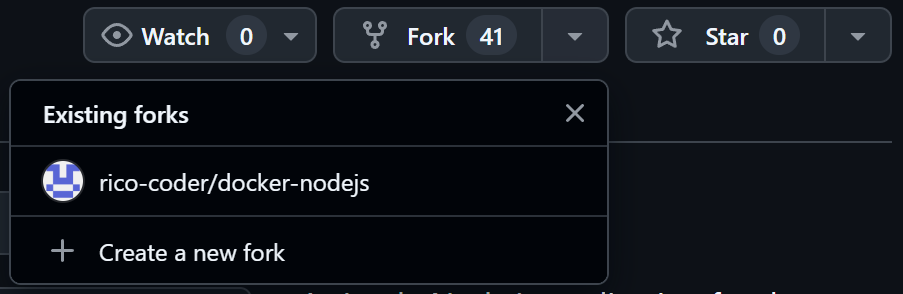

# **Aufgabe:** Erstellen einer ToDo-Applikation mit Markdown, Git, GitHub und Docker

In dieser Abschlussaufgabe werden alle erlernten Fähigkeiten in den Bereichen **Markdown**, **Git**, **GitHub** und **Docker** kombiniert. Die Aufgabe besteht darin, eine ToDo-Applikation zu erstellen und diese in einem Docker-Container bereitzustellen.

### **Installation des Projekts**

**Klonen des Repositories**
- Ich habe eine Fork des folgenden GitHub-Repositories erstellt:
[docker-nodejs-sample](https://github.com/ICT-BLJ/docker-nodejs-sample). Dies habe ich gemacht indem ich oben rechts im Repo auf _Fork_ und _Create a new Fork_ gegangen bin. Wie es im Bild erichtlich ist: 
- Um es zu bearbeite habe ich es jetzt noch gecloned. Dies habe ich gemacht indem ich im VS Code Terminal `git clone https://github.com/rico-coder/docker-nodejs` eingegeben habe.

### Docker-Konfiguration und -Installation
1. Docker Desktop instalieren: [docker-desktop](https://www.docker.com/products/docker-desktop/)
2. Docker for Visual Studio Code: [VS-Code docker](https://marketplace.visualstudio.com/items?itemName=ms-azuretools.vscode-docker)
3. WSL 2 updaten und wenn nötig neu starten
### Installation der notwendigen Pakete
1. Den command `docker init` im Command terminal im docker-nodejs-sample directory eingeben.
2. Fragen Beantworten:

   What application platform does your project use?\
   Node

   What version of Node do you want to use?\
   18.0.0

   Which package manager do you want to use?\
   npm

   What command do you want to use to start the app:\
   node src/index. js

   What port does your server listen on?\
   3000

### Starten der Applikation in einem Docker-Container
Die Applikation kann mit dem Command gestartet werden: `docker compose up --build`